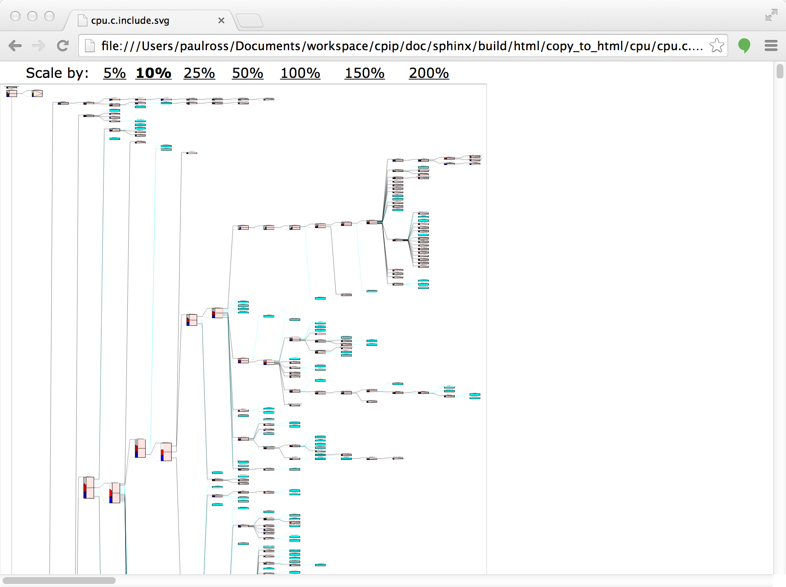
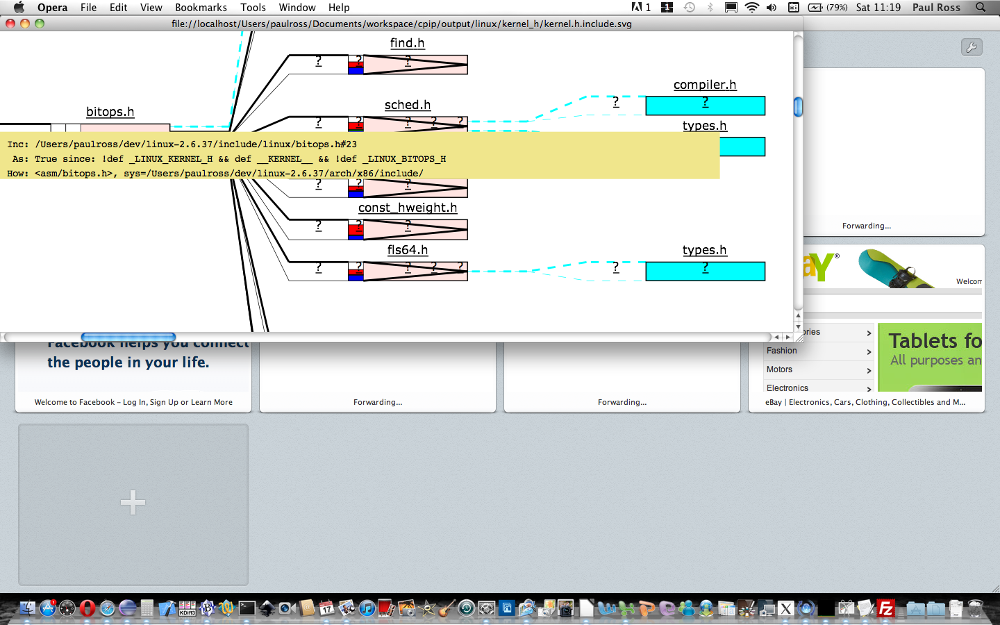

cpip
====

CPIP is a C/C++ Preprocessor implemented in Python. It faithfully records all aspects of preprocessing and can produce visualisations that make debugging preprocessing far easier.

Features
--------

* Conformant C/C++ preprocessor.
* Gives programatic access to every preprocessing token and the state of the preprocessor at any point during preprocessing.
* Top level tools such as ``CPIPMain.py`` can generate preprocessor visualisations from the command line.
* Requires only Python 2.7 or 3.3+
* Fully documented: https://cpip.readthedocs.io.
* Free software: GNU General Public License v2

Visualising Preprocessing
=============================

The top level script ``CPIPMain.py`` acts like a preprocessor that generates HTML and SVG output for a source code file or directory. This output makes it easy to understand what the preprocessor is doing to your source.

Here is that output when preprocessing a single Linux kernel file ``cpu.c``, the ``index.html`` page shows how ``CPIPMain.py`` was invoked [#f1]_ with a link to to preprocessing pages:

.. Comment: docs/doc_src/ prefix in front of examples/ is required at top level

.. image:: docs/doc_src/examples/images/HTMLLinux_cpu.c_Index.png
    :alt: CPIPMain.py's index.html landing page.
    :width: 640

This page has a single link that takes you to the landing page for the file ``cpu.c``, at the top this links to other pages that visualise source code, ``#include`` dependencies, conditional compilation and macros:

.. image:: docs/doc_src/examples/images/HTMLLinux_cpu.c_Home_Top.png
    :alt: CPIP landing page after preprocessing cpu.c from the Linux kernel.
    :width: 640
    
Lower down this page is a table of files that were involved in preprocessing:

.. image:: docs/doc_src/examples/images/HTMLLinux_cpu.c_Home_Lower_Lower_edit.png
    :alt: CPIP landing page after preprocessing cpu.c from the Linux kernel.
    :width: 480

Visualising the Source Code
-----------------------------

From the ``cpu.c`` landing page the link "Original Source" takes you to a syntax highlighted page of the original source of ``cpu.c``.

.. image:: docs/doc_src/examples/images/HTMLLinux_cpu.c_ITU_edit.png
    :alt: Annotated source code of cpu.c
    :width: 480

The ``cpu.c`` landing page link "Translation Unit" takes you to a page that shows the complete translation unit of ``cpu.c`` (i.e. incorporating all the ``#include`` files). This page is annotated so that you can understand what part of the translation unit comes from which file.

.. image:: docs/doc_src/examples/images/HTMLLinux_cpu.c_TU_edit.png
    :alt: Annotated translation unit produced by cpu.c
    :width: 480

Visualising the ``#include`` Dependencies
---------------------------------------------

The ``cpu.c`` landing page link "Normal [SVG]" takes you to a page that shows the dependencies created by ``#include`` directives. This is a very rich page that represents a tree with the root at center left. ``#include``'s are in order from top to bottom. Each block represents a file, the size is proportional to the number of preprocessing tokens.

Zooming in with the controls at the top gives more detail. If the box is coloured cyan it is because the file does not add any content to the translation unit, usually because of conditional compilation:

.. image:: docs/doc_src/examples/images/SVG_CPU_FileDetail.png
    :alt: Example of the file stack pop-up in the SVG include graph.
    :width: 640

The page is dynamic and hovering over various areas provides more information:

How and Why the File was Included
^^^^^^^^^^^^^^^^^^^^^^^^^^^^^^^^^^^^^

Hovering just to the left of the file box produces a popup that explains how the file inclusion process worked for this file, it has the following fields:

* Inc: The filename and line number of the ``#include`` directive.
* As: The conditional compilation state at the point of the ``#include`` directive.
* How: The text of the ``#include`` directive followed by the directory that this file was found in, this directory is prefixed by ``sys=`` for a system include and ``usr=`` for a user include.

Hovering over the filename above the file box shows the file stack (children are below parents).

.. image:: docs/doc_src/examples/images/SVG_CPU_FileDetail_FileStack.png
    :alt: Example of the file stack pop-up in the SVG include graph.
    :width: 640

This plot can also tell you what types of preprocessor tokens were processed for each file. The coloured bars on the left of the file box indicate the proportion of preprocessing token types, the left is the file on its own, the right is the file and its child files. To understand the legend hover over those bars:

.. image:: docs/doc_src/examples/images/SVG_CPU_FileDetail_HistLegend.png
    :alt: Legend for preprocessing token types.
    :width: 640

To see the actual count of preprocessing tokens hover over the file box:

.. image:: docs/doc_src/examples/images/SVG_CPU_FileDetail_TokenCount.png
    :alt: Count of preprocessing token types.
    :width: 640

Visualising Conditional Compilation
--------------------------------------

The preprocessor is also responsible for handling conditional compilation which becomes very complicated for large projects. ``CPIPMain.py`` produces a succinct representation showing only the conditional directives. The links in each comment takes you to the syntax highlighted page for that file.

.. image:: docs/doc_src/examples/images/HTMLLinux_cpu.c_CondComp.png
    :alt: Conditional compilation in the translation unit.
    :width: 640

Understanding Macros
---------------------------

CPIP tracks every macro definition and usage and ``CPIPMain.py`` produces a page that describes all the macros encountered:

.. image:: docs/doc_src/examples/images/HTMLLinux_cpu.c_Macro_Top.png
    :alt: The top of the macro page with down page links to details of each macro.
    :width: 640

Each link on the page takes you to a description of the macro containing:

* The macro name, how many times it was referenced and whether it is still defined at the end of preprocessing.
* The verbatim macro definition (rewritten over several lines for long macros).
* File name and line number of definition, linked.
* Places that the macro was used, directly or indirectly. This is a table of file paths with links to the use point.
* Dependencies, two way:
    * Macros that this macro invokes.
    * Macros that invoke this macro.

.. image:: docs/doc_src/examples/images/HTMLLinux_cpu.c_Macro_Detail.png
    :alt: Macro BITMAP_LAST_WORD_MASK details: definition, where defined, where used and two way dependencies.
    :width: 640

Status
------

.. image:: https://img.shields.io/pypi/v/cpip.svg
        :target: https://pypi.python.org/pypi/cpip

.. image:: https://img.shields.io/travis/paulross/cpip.svg
        :target: https://travis-ci.org/paulross/cpip

.. image:: https://readthedocs.org/projects/cpip/badge/?version=latest
        :target: https://cpip.readthedocs.io/en/latest/?badge=latest
        :alt: Documentation Status

.. image:: https://pyup.io/repos/github/paulross/cpip/shield.svg
     :target: https://pyup.io/repos/github/paulross/cpip/
     :alt: Updates

Licence
-------

CPIP is a C/C++ Preprocessor implemented in Python.
Copyright (C) 2008-2017 Paul Ross

This program is free software; you can redistribute it and/or modify
it under the terms of the GNU General Public License as published by
the Free Software Foundation; either version 2 of the License, or
(at your option) any later version.

This program is distributed in the hope that it will be useful,
but WITHOUT ANY WARRANTY; without even the implied warranty of
MERCHANTABILITY or FITNESS FOR A PARTICULAR PURPOSE.  See the
GNU General Public License for more details.

You should have received a copy of the GNU General Public License along
with this program; if not, write to the Free Software Foundation, Inc.,
51 Franklin Street, Fifth Floor, Boston, MA 02110-1301 USA.

Credits
---------

This package was created with Cookiecutter_ and the `audreyr/cookiecutter-pypackage`_ project template.

.. _Cookiecutter: https://github.com/audreyr/cookiecutter
.. _`audreyr/cookiecutter-pypackage`: https://github.com/audreyr/cookiecutter-pypackage

Also many thanks to `SourceForge <http://cpip.sourceforge.net/>`_ that hosted this project for many years.

.. rubric:: Footnotes

.. [#f1] This was invoked by:

.. code-block:: sh

    $ python3 CPIPMain.py -kp -l20 -o ../../output/linux/cpu -S __STDC__=1 -D __KERNEL__ -D __EXPORTED_HEADERS__ -D BITS_PER_LONG=64 -D CONFIG_HZ=100 -D __x86_64__ -D __GNUC__=4 -D __has_feature(x)=0 -D __has_extension=__has_feature -D __has_attribute=__has_feature -D __has_include=__has_feature -P ~/dev/linux/linux-3.13/include/linux/kconfig.h -J /usr/include/ -J /usr/include/c++/4.2.1/ -J /usr/include/c++/4.2.1/tr1/ -J /Users/paulross/dev/linux/linux-3.13/include/ -J /Users/paulross/dev/linux/linux-3.13/include/uapi/ -J ~/dev/linux/linux-3.13/arch/x86/include/uapi/ -J ~/dev/linux/linux-3.13/arch/x86/include/ -J ~/dev/linux/linux-3.13/arch/x86/include/generated/ ~/dev/linux/linux-3.13/kernel/cpu.c
