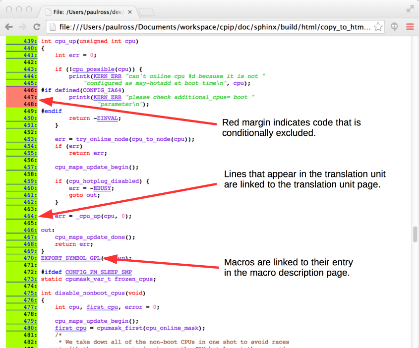
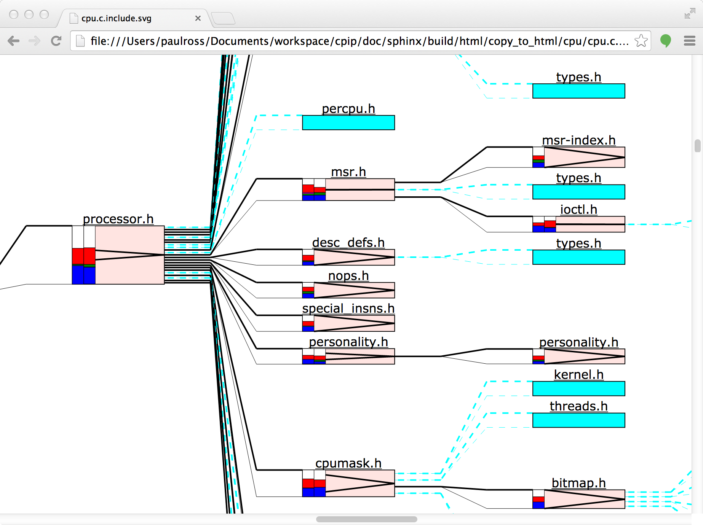
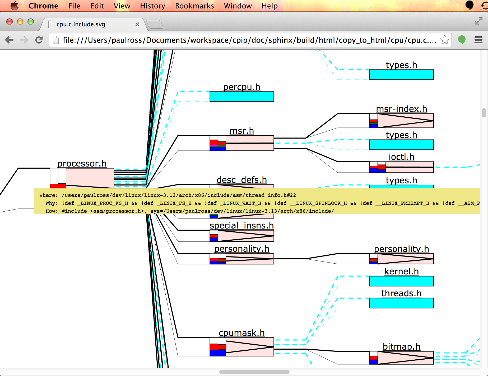
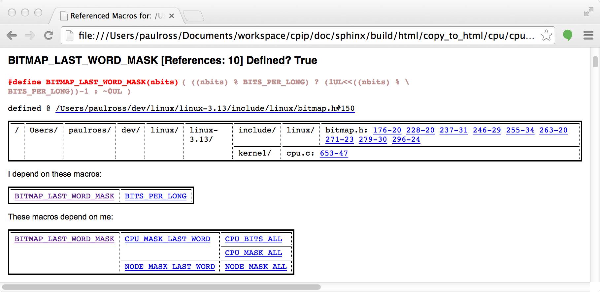

.. moduleauthor:: Paul Ross <cpipdev@googlemail.com>
.. sectionauthor:: Paul Ross <cpipdev@googlemail.com>

.. Examples of CPIP output

.. _cpip-examples:

#######################################
:file:`CPIPMain.py` Examples
#######################################

***************************************
Screenshots
***************************************

This section shows some screenshots of :file:`CPIPMain.py`'s output. :ref:`cpip-examples-real` are shown below.

:file:`CPIPMain.py` produces a set of HTML and SVG pages for each source file preprocessed. As well as the *Translation Unit* :file:`CPIPMain.py` generates information about the three important tasks for a preprocessor: file inclusion, conditional compilation and macro replacement.

=======================================
Home Page
=======================================

The :file:`index.html` shows the list of files preprocessed in this pass (linked to file specific pages).

It also shows the command line used and an explanation from the :file:`CPIPMain.py` help system as to what each option means.

For example:

.. image:: images/HTMLLinux_cpu.c_Index.png
   :alt: The overall SVG diagram.
   :align: center

Each in the list of files preprocessed in this pass is linked to file specific page.

=======================================
Preprocessed File Specific Page
=======================================

These describe the results of preprocessing a single file, it contains links to:

#. The source and the translation unit as HTML.
#. The results of file inclusion.
#. The results of conditional compilation.
#. Macro processing results.
#. The total token count.
#. What files were included and how many times.

The top of the page includes links to these sections (described in detail below):

.. image:: images/HTMLLinux_cpu.c_Home_Top.png
   :alt: The overall SVG diagram.
   :align: center

Further down the page is a table showing what files were included, from where and how many times:

.. image:: images/HTMLLinux_cpu.c_Home_Lower.png
   :alt: The overall SVG diagram.
   :align: center

Here is an explanation for the table:

.. image:: images/HTMLLinux_cpu.c_Home_Lower_Lower_edit.png
   :alt: Files used.
   :align: center

Original File and the Translation Unit
=======================================

Original  File
----------------------

All processed source code (original file and and included files) is presented as syntax highlighted HTML.

The syntax is the C pre-preprocessor language. Macro names are linked to their definition in the :ref:`cpip_macro_page_example` page.

Translation Unit
----------------------

The preprocessed file and all its ``#include``'s become a *Translation Unit* which :file:`CPIPMain.py` represents as an HTML page.

Each ``#include`` statement is represented in a nested fashion, any source code in the translation unit is presented syntax highlighted. The syntax is, of course, the C pre-processor language thus both ``typedef`` and ``char`` are pre-processor *identifiers* even if later on ``typedef`` is seen as a C keyword.

The numbered links thus ``[       19]`` are to an HTML representation of the orignal source code file/line.

The other navigational element present is when the file path is the file being pre-processed a forward link is there to to the next part of this file, thus skipping over intermediate ``#include``'d code.

.. image:: images/HTMLLinux_cpu.c_TU_edit.png
   :alt: The complete translation unit represented in HTML.
   :align: center

Further down you can see the actual code from ``cpu.c``, notice the macro expansion on line 76.

.. image:: images/HTMLLinux_cpu.c_TU_Lower.png
   :alt: The complete translation unit represented in HTML.
   :align: center

The SVG Include Graph
=================================

The file specific page offers a link to an SVG visualisation of the file include graph.

The Overall Picture
-----------------------

The diagram represents a tree with the root (the file being preprocessed) at center left. Each node represents a file and each edge represents an ``#include`` directive. Increasing include depth is left-to-right and source code order (i.e. order of the ``#include`` directives) is top to bottom.

At the top are various zoom factors that you can use to view the graph, initially the page opens at the smallest scale factor to give you an impression of what is going on:

.. image:: images/SVG_CPU_OpeningPage.png
   :alt: The overall SVG diagram for cpu.c.
   :align: center

A Detailed Look
-----------------------

Zooming in to 100% on one part of the graph gives a wealth of information. In this picture the :file:`processor.h` file is represented on the left and the files that it ``#include``'s to its right.:

Each file is represented by a fixed width block, the height is proportional to the number of preprocessing tokens produced by a file (and its ``#include``'s) [#]_. Cyan coloured blocks represent files that are included but contain no effective content, usually because it has already been included and the header guards use conditional compilation to prevent preprocessing more than once (``types.h`` for example).

The 'V' symbol in the block represents the relative size of the file and its descendants, if the 'V' touches top and bottom then all the tokens come from this file (``personality.h`` for example). Where the 'V' is closed, or almost so, it means the bulk of the tokens are coming from the descendent includes (``msr.h`` for example).

The coloured bars on the left represent the count of different token types, the left bar being the current file, the right bar being the total of the descendants. See below for which :ref:`token_types` corespond to each colour.

Many parts of this diagram can display additional information when moving the mouse over various bits of the file block. 

File Path
^^^^^^^^^^^^^^^^^^^^^^^^^^^^^^^^^^^^^^^^

For example mousing over the file name above the box shows the the absolute path of the file stack as a pop-up yellow block. At the top of this list is the file we are preprocessing, then the stack of included files downwards to ``processor.h``:

.. image:: images/SVG_CPU_FileDetail_FileStack.png
   :alt: The result of mousing over the file name.
   :align: center
   
How it was Included?
^^^^^^^^^^^^^^^^^^^^^^^^^^^^^^^^^^^^^^^^

Moving the mouse over to the left of the block reveals a host of information about the file inclusion process:

This pop-up yellow block contains the following:

* ``Where:`` *Where* this was included from. This file is included from line 22 of the :file:`arch/x86/include/asm/thread_info.h` file.
* ``Why:`` *Why* it was included. This is the current state of the conditional compilation stack.
* ``How:`` *How* this file was included. This string starts with the text that follows the ``#include`` statement, in this case ``#include <asm/processor.h>``. This is followed by the search results, in this case this file was found by searching the system includes (``sys=``) and was found in :file:`arch/x86/include`. There may be more than one search made as fallback mechanisms are used and a failure will be shown with ``None``. For example ``usr=None sys=spam/eggs`` means that the user include directories were searched first and nothing came up, then the system include directories were searched and the file was found in :file:`spam/eggs`. A special case; ``CP:`` means 'the current place'.

.. _token_types:

Token Types
^^^^^^^^^^^^^^^^^^^^^^^^^^^^^^^^^^^^^^^^

If you are interested in what types of preprocessor tokens were encountered than there is a host of information available to you. On the left hand side of each file block is a colour coded histogram of token types. If the file includes others then there will be two, the left hand one is for the file, the right hand one is for all the files it includes. Hovering over either histogram pops up the legend thus:

.. image:: images/SVG_CPU_FileDetail_HistLegend.png
   :alt: The legend for the histogram bars.
   :align: center

The actual count of tokens is seen when moving the mouse over the centre of the box. There are three sets of two columns, the left column of the set is total tokens, the right column is for *significant* tokens, that is those that are not conditionally excluded by ``#if`` etc. statements.

The first set is for the specific file, the second set is the descendents and the third set is the total.

.. image:: images/SVG_CPU_FileDetail_TokenCount.png
   :alt: Token counts.
   :align: center

Conditional Compilation
=================================

One tricky area for comprehending source code is understanding what code is conditionally compiled. Looking at a source file it is not immediately obvious which ``#if`` etc. statements are actually being processed.

As an aid CPIP produces an HTML page that is the translation unit with *only* the conditional compilation statements, what is more they are nested according to their logical execution condition and colour coded according to the resolved state; green means code will be part of the translation unit and red means those statements will be ignored. The links in the (artificial) comment following the statement are to the HTML representation of the file where the statement occurs.

Here is an example:

.. image:: images/HTMLLinux_cpu.c_CondComp.png
   :alt: Conditional compilation.
   :align: center

.. _cpip_macro_page_example:

Macro Definitions
=================================

CPIP retains all information about marcos during preprocessing and the file specific page containing macro information starts like this:

.. image:: images/HTMLLinux_cpu.c_Macro_Top.png
   :alt: Macro information.
   :align: center

The contents starts with a list of links to macro information further down the page; the first set of links is alphabetical to all macros that are declared, even if they are not used. The second set is to any macros that are actually used in pre-processing this file.

These are all linked to the macro details that looks like this, for example ``BITMAP_LAST_WORD_MASK``:

Each macro description has the following:

* The macro name followed by the reference count for the macro i.e. how many times the pre-processor was required to invoke the definition. This line ends with whether it is still defined at the end of preprocessing (True in this case).
* The macro definition (this is artificially wrapped for clarity).
* Following ``defined @`` is where the macro was defined and a link to the source file where the the macro is defined.
* Then follows a table of locations that the macro was used. In this case it was referenced by ``include/linux/bitmap.h`` on line 176, column 20, then line 228, column 20 and so on. Each of these references is a link to the source file representation where the macro is used. NOTE: Where macros are defined in terms of other macros then this location will not necessarily have the literal macro name, it is implicit because of macro dependencies. For example if you look at the last entry ``kernel/cpu.c`` line 653, column 47 then you do not see ``BITMAP_LAST_WORD_MASK``, instead you see ``CPU_BITS_ALL`` however ``CPU_BITS_ALL`` is defined in terms of ``BITMAP_LAST_WORD_MASK``.
* After "I depend on these macros" is a table (a tree actually) of other macros (with links) that ``BITMAP_LAST_WORD_MASK`` depend on, in this case only one, ``BITS_PER_LONG`` as you can see in the definition.
* After "These macros depend on me" is another table (a tree) of other macros (with links) that depend on ``BITMAP_LAST_WORD_MASK``.

A Most Powerful Feature
============================

CPIP's knowledge about macros and its ability to generate linked documents provides an especially powerful feature for understanding macros.

.. _cpip-examples-real:

*******************************
Some Real Examples
*******************************

CPIPMain is a command line tool that you can invoke very much like your favorite pre-processor. CPIPMain produces a number of HTML pages and SVG files that make it easier to understand what is happening during preprocessing. This section shows some examples of the kind of thing that CPIP can do.

=======================================
The Linux Kernel
=======================================

Here is :file:`CPIPMain.py` pre-processing the `cpu.c <../copy_to_html/cpu/index.html>`_ file from the Linux Kernel.

.. rubric:: Footnotes

.. [#] A special case is that the may be a file ``"Unnamed Pre-Include"`` at the top left and joined to the preprocessed file with a thick light grey line. This 'virtual' file contains the macro declarations made on the :file:`CPIPMain.py` command line.